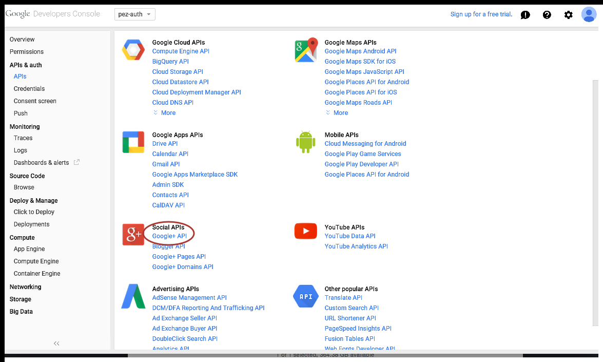

#Run pez auth locally

pezauth intends to run in cloudfoundry environment. In order to help developer
quickly setup local development environment, we use wercker and docker to run
the application and provides the integration points


##Prerequisites

### requires the [wercker cli](http://devcenter.wercker.com/docs/using-the-cli/installing.html)

### [Setup boot2docker](http://boot2docker.io/)

### Integration environment variables

* create a file with following environment variables:

```
# Cloudfoundry environment

X_CF_USER=xxx@pivotal.io
X_CF_PASS=xxxxxxxxxx
X_CF_DOMAINNAME=cfapps.pez.pivotal.io
X_CF_LOGINURL=login.run.pez.pivotal.io
# Wercker debug

X_DEBUG_STEP=true

#New Relic
X_NEWRELIC_APP=golang
X_NEWRELIC_KEY=xxxxxxxxxxxxxxxxxxxxxxxxxx

# SMTP Server
X_SMTP_HOST=smtp.vchs.pivotal.io
X_SMTP_PORT=25
X_SMTP_SUPPORT_EMAIL=xxxxxxxxxxxxxx

# Google oauth client key
X_GOOGLE_CLIENT_ID=xxxxxxxxxxxxxxxxxxxxxxxxxxxxxxxxx
X_GOOGLE_CLIENT_SECRET=xxxxxxxxxxxxxxxxxxxxxxxxxxxxx

# Local DOCKER IP Address
X_DOCKER_IP=192.168.59.104
```
* Cloudfoundry environment variables

Developer could get a cloudfoundry org from [pez](https://hcf.cfapps.pez.pivotal.io)

**Note: In order to fully functional testing creation of org. Developer needs to setup these variables with a cloudfoundry admin role user**

* Google oauth client key

Developer could use [developer console] (https://console.developers.google.com) to get a client id and client secret and make sure the redirect URI including the ${X_DOCKER_IP}.xip.io/oauth2callback


Also make sure the google+ API is enabled



* New Relic APP name and New Relic secret

Developer can sign up a free account for new relic at http://newrelic.com

* Docker IP address

The docker ip could be found by running

```
boot2docker ip
192.168.59.103
```

* How to run

```
./runlocaldeploy [env file]
```

Once the application is up. Developer can functionally test their application at: http://192.168.59.103.xip.io
